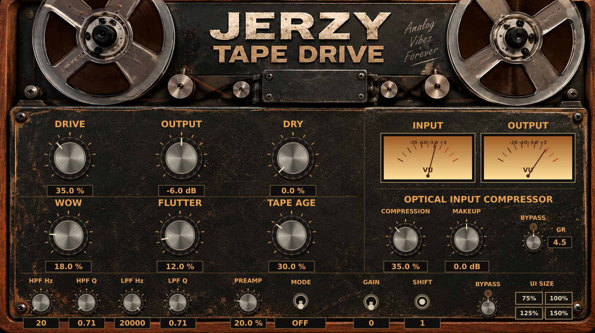

# Jerzy Audio VST3

Repozytorium zawiera dwie osobne wtyczki: **Jerzy Tape Delay** i **Jerzy Tape Drive**.

## Tape Drive — Analog Vibes



Panel Tape Drive nawiązuje do dostarczonego wzoru: drewniana obudowa, zużyty metal,
szpule, metalowe gałki i bursztynowe wskaźniki. Ilustracja pokazuje układ oraz
przykładowe ustawienia; nie jest zrzutem okna DAW.

- **DRIVE**: nasycenie taśmy. **OUTPUT**: poziom całego toru mokrego, razem z szumem.
- **DRY**: dodanie oryginalnego sygnału (dotychczasowy tryb addytywny).
- **WOW**: wolne, losowo zmieniające się odchylenia transportu.
- **FLUTTER**: niezależne, szybsze i nieregularne drżenie transportu.
- **TAPE AGE**: szum taśmy, losowe trzaski, krótkie ubytki sygnału i utrata góry.
  Przy 0% nie dodaje szumu ani trzasków. Artefakty pojawiają się także na ciszy.
- **OPTICAL INPUT COMPRESSOR**: miękkie kolano, detekcja połączona dla stereo,
  szybka i wolna faza powrotu z pamięcią poziomu. COMPRESSION reguluje ilość
  kompresji, MAKEUP poziom przed przedwzmacniaczem, GR pokazuje redukcję w dB.
- **PREAMP**: OFF / TUBE / TRANSISTOR; **GAIN** i **SHIFT** zachowują swoje funkcje.
- **HPF / LPF**: częstotliwości filtrów i rezonans Q na wyjściu.
- Lampka przy **BYPASS** świeci, gdy dana sekcja jest pomijana.
  Przełączniki zmieniają stan po kliknięciu; gałki obsługują przeciąganie,
  kółko myszy i reset do wartości domyślnej zgodnie z obsługą VSTGUI/DAW.
- **UI SIZE**: 75 / 100 / 125 / 150%, z uwzględnieniem skali ekranu.
  Ręczna zmiana rozmiaru dopasowuje cały panel i obszary kliknięć do rzeczywistego
  obszaru GUI w DAW, także gdy host pomija ograniczenia proporcji.

Tor mokry: wejście → kompresor optyczny → przedwzmacniacz → saturacja taśmy →
transport Wow/Flutter → zużycie taśmy → OUTPUT → filtry wyjściowe.
Transport jest wspólny dla kanałów stereo; szum, trzaski i ubytki są niezależne.
Wow/Flutter używają interpolowanych losowych trajektorii o zmiennym czasie,
zamiast cyklicznych sinusoid. Przy aktywnej modulacji tor mokry ma ruchome
opóźnienie około 4 ms; DRY pozostaje bez opóźnienia. To może dać interferencję
przy mieszaniu z sygnałem suchym, tak jak przy modulowanej taśmie.

## Zgodność projektów

Dotychczasowe identyfikatory parametrów i identyfikatory wtyczek pozostają stałe.
Stary parametr Wow/Flutter (ID 311) jest teraz Wow; przy wczytywaniu starych
stanów Flutter otrzymuje 25% jego wartości. Nowe pola są dopisane na końcu
stanu. W starych projektach Age pozostaje na 0%, a nowy kompresor jest pomijany.
Zmieniony model modulacji nie odtwarza starego efektu bit po bicie.

## Kompilacja i pobieranie

Workflow **Build Windows VST3** buduje obie wtyczki dla Windows x64,
uruchamia testy DSP i natywny test otwartego GUI w oknie Windows, a następnie
publikuje osobne artefakty. Test GUI sprawdza przyciski powiększenia, zmianę DPI,
wyszukiwanie parametrów pod kursorem oraz rzeczywiste kliknięcia po resize.
W zakładce **Actions**, w zakończonym przebiegu, wybierz
**JerzyTapeDrive-Windows-x64** i rozpakuj `JerzyTapeDrive.vst3` do
`C:\Program Files\Common Files\VST3`. Następnie przeskanuj wtyczki w DAW.

Lokalnie potrzebne są CMake 3.25+, C++17 i oficjalny Steinberg VST3 SDK
z submodułami. SDK można wskazać przez `VST3_SDK_ROOT`.

```sh
cmake -S . -B build -DVST3_SDK_ROOT=/path/to/vst3sdk -DSMTG_CREATE_PLUGIN_LINK=0
cmake --build build --config Release --target JerzyTapeDrive TapeDriveDSPTests
ctest --test-dir build -C Release --output-on-failure -R TapeDriveDSP
```

Same testy DSP można zbudować bez SDK:

```sh
c++ -std=c++17 -O2 tests/tapedrive_test.cpp -o tapedrive_test
./tapedrive_test
```
